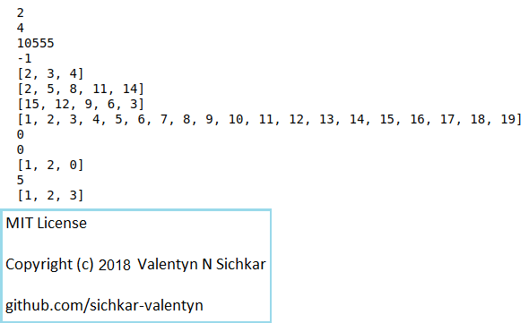

# Simple Functions in Python
Simple examples on how to create and use functions in Python

### Reference to:
[1] Valentyn N Sichkar. Simple examples on hoe to create and use functions in Python // GitHub platform [Electronic resource]. URL: https://github.com/sichkar-valentyn/Simple_Functions_in_Python (date of access: XX.XX.XXXX)

## Description
Examples on how to create and use functions in Python.

## GUI in Python

## MIT License
## Copyright (c) 2018 Valentyn N Sichkar
## github.com/sichkar-valentyn
### Reference to:
[1] Valentyn N Sichkar. Simple examples on hoe to create and use functions in Python // GitHub platform [Electronic resource]. URL: https://github.com/sichkar-valentyn/Simple_Functions_in_Python (date of access: XX.XX.XXXX)
